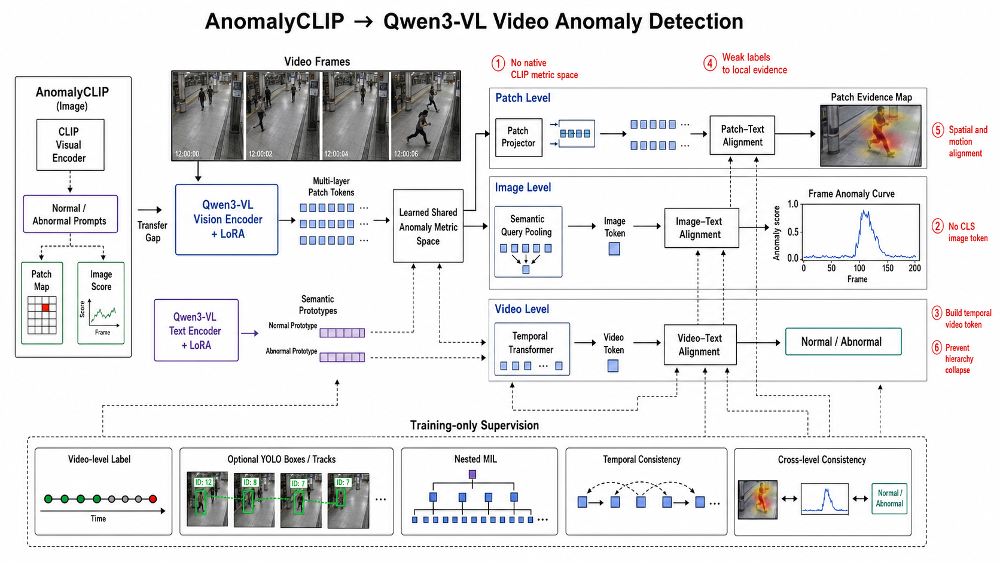

# Qwen3-VL 视频异常检测：AnomalyCLIP 迁移中的核心问题

## 目标

本方案研究如何在 `Qwen3-VL-8B-Instruct` 上实现类似 AnomalyCLIP 的正常/异常语义对齐，并把原有的 Patch–Image 两级异常检测扩展为 **Patch–Image–Video** 三级视频异常检测。

当前内容属于待验证的方法候选，不代表已经采用或得到实验验证的主方法。

## 端到端 Pipeline

图中实线表示训练与推理共同使用的模型路径；虚线表示视频标签、可选 YOLO 结果和一致性约束等训练期监督。YOLO 是可选的空间教师，不是推理阶段必须依赖的主干模块。

## 需要解决的五个核心问题

| 序号 | 核心问题 | 解决思路 |
| --- | --- | --- |
| 1 | Qwen 没有原生 CLIP 度量空间 | 通过 LoRA 以及 Text、Patch、Image、Video Projector，显式学习正常/异常共享空间；不能直接使用原始视觉与文本 hidden states 的 cosine 作为语义相似度。 |
| 2 | 如何提取 Patch 特征 | 选择 Qwen 视觉编码器的 pre-merger、多层局部 Tokens，并保存预处理变换和视觉网格信息，保证每个 Token 能映射回原始视频帧中的空间区域。 |
| 3 | Qwen 没有 CLS Image Token | 使用 Semantic Query Pooling，从单帧的 Patch Tokens 中构造任务相关的 Image Token，作为独立的帧级异常表示。 |
| 4 | Qwen 没有现成 Video Token | 使用 Temporal Transformer 对按时间排列的 Image Tokens 建模，再通过时序聚合构造 Video Token，用于视频级异常判断。 |
| 5 | Prompt 如何同时对齐三级视觉信息 | Patch、Image、Video 共享同一组正常/异常语义原型，但分别使用独立的视觉投影器、兼容度函数和温度参数进入共享异常度量空间。 |

## 三级对齐关系

### Patch Level

多层局部视觉 Tokens 经过 Patch Projector 后，与正常/异常语义原型对齐，输出每帧的 `Patch Evidence Map`。该结果表示模型空间证据；在没有独立空间标注验证前，不能称为异常分割结果。

### Image Level

Semantic Query Pooling 聚合单帧 Patch Tokens，得到 Image Token。Image Token 独立与正常/异常语义原型对齐，输出逐帧异常分数，而不是简单对 Patch 分数取最大值。

### Video Level

Temporal Transformer 对 Image Token 序列建模，构造包含事件发展过程的 Video Token。Video Token 与相同语义原型对齐，输出视频级正常/异常判断。

## 关键设计原则

- 不假设 Qwen 原始视觉与文本隐状态天然形成 CLIP 式度量空间。
- 只建立一个任务级正常/异常共享语义空间，而不是三个互不相关的隐空间。
- Patch、Image、Video 使用不同投影器，以适配不同粒度的特征分布。
- Image Token 和 Video Token 必须由模型显式构造，不能冒充 Qwen 原生 CLS Token。
- 三级输出应当相互约束，但不能退化为简单的 `max` 或 `mean` 关系。
- 模型生成的 Patch 热图在通过独立空间标注验证前统一称为 `model_evidence_map`。
