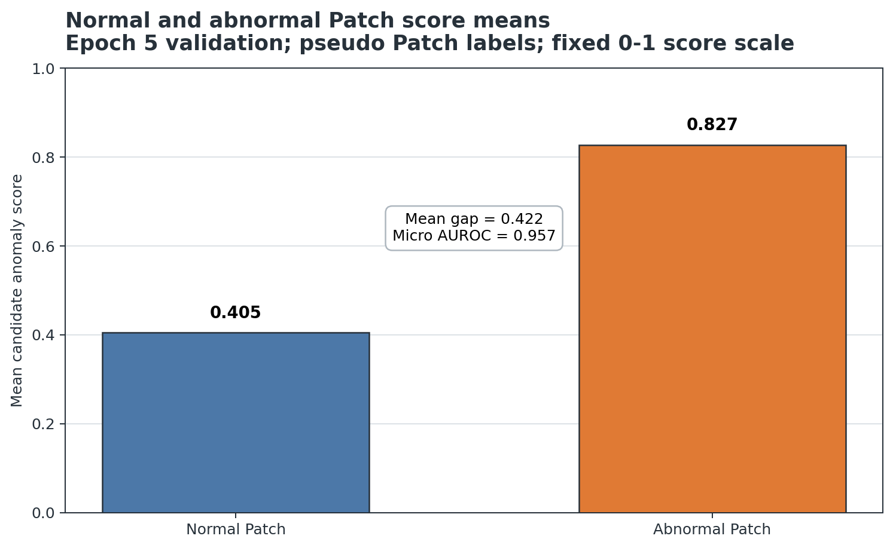
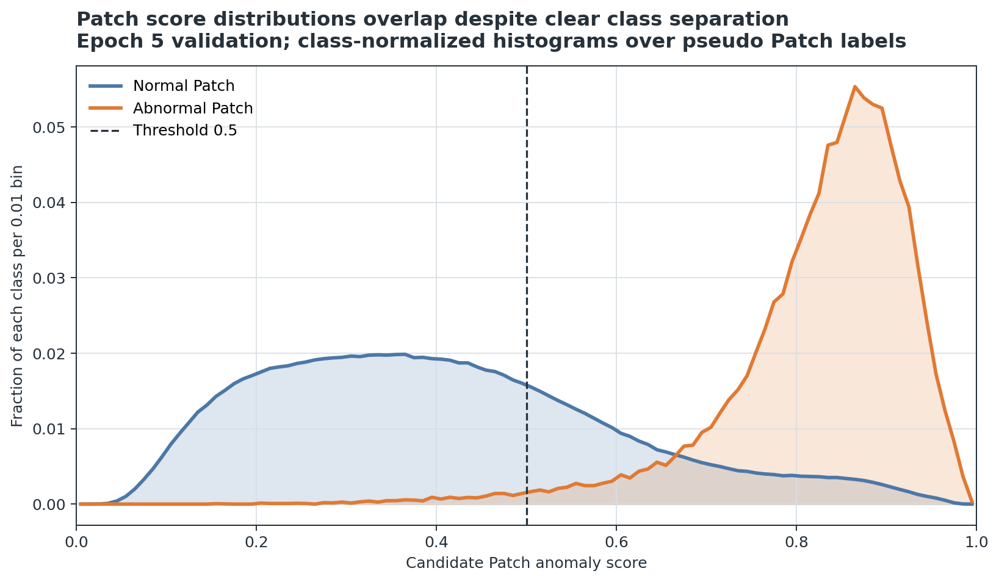
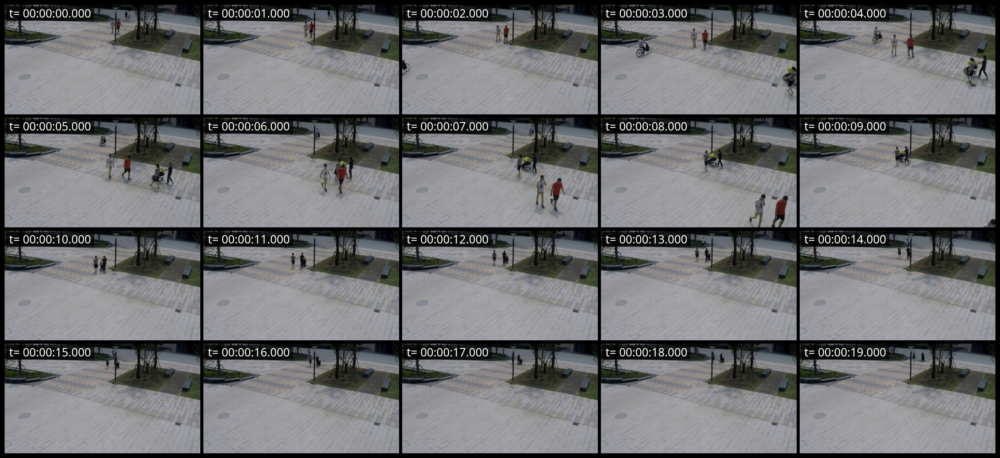
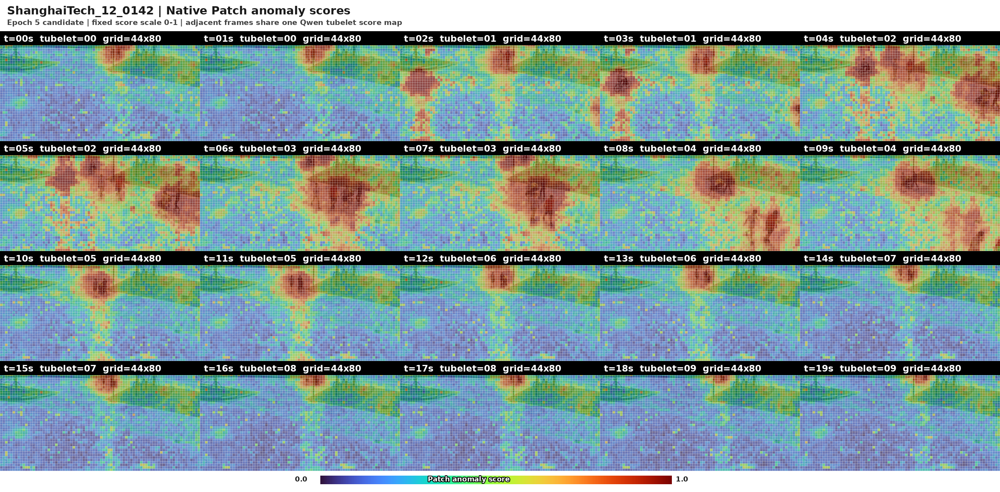

# Qwen3-VL Patch 异常检测：当前训练结果与 Token 压缩诊断

> 数据快照：2026-08-11 至 2026-08-12
>
> 报告状态：**候选实验结果（candidate/debug only），不是 VerifiedFinding**
>
> 当前判断：Patch 打分器已经学到正常/异常 Patch 的统计区分，但端到端 Qwen3-VL 暂时不能稳定识别“校园步行广场内骑自行车”这一场景规则异常；现有单视频证据也不支持 Token 压缩提升异常检测能力。

## 技术摘要

当前模型在伪 Patch 标签验证集上表现出明确的排序能力：异常 Patch 的平均异常分数为 `0.827`，正常 Patch 为 `0.405`，均值差为 `0.422`，Micro AUROC 为 `0.957`。这说明模型输出的 Patch 分数具有可用的区分方向。

但这些分数还不是经过校准的概率，两个类别仍有重叠。使用固定阈值 `0.5` 时，异常 Patch 召回率达到 `98.39%`，同时正常 Patch 误报率也达到 `28.78%`。因此当前结果可以表述为“能够排序和区分”，不能表述为“已经可靠完成 Patch 异常识别”。

在 `ShanghaiTech_12_0142` 单视频诊断中，无压缩、保留约 75%、50%、25% 视觉 Token 的端到端结果全部判为正常。保留约 10% 时，生成正文出现了“广场骑车违规”的事件描述，但前导二分类仍判为正常，且结构化输出验证失败。因此按既定判定合同，它仍然是失败样本，不能作为压缩改善 VAD 的证据。

## 1. 当前训练架构

本轮训练不是对完整 Qwen3-VL 做全参数微调，而是在冻结特征与冻结适配器基础上训练一对全局 Soft Prompt：

| 项目 | 当前设置 |
|---|---|
| 基础模型 | Qwen3-VL-8B-Instruct |
| 输入采样 | 1 FPS |
| 空间单元 | pre-merger 原生 `16×16` Patch |
| 时间单元 | `temporal_patch_size=2`，相邻两帧组成一个 tubelet |
| 使用的 ViT 层 | H8、H16、H24、H26 |
| 语义原型 | 全数据共享的一对 Normal / Abnormal Soft Prompt |
| 可训练参数 | `soft_prompts[2,12,4096]`，共 `98,304` 个参数 |
| 冻结内容 | Qwen3-VL、H/G 投影、层混合、G 残差门、温度与文本投影 |
| Patch 分数 | Normal/Abnormal Prompt 对比后得到候选异常分数 |
| 监督 | 伪 Patch 标签；Ignore Patch 不进入分类损失 |

因此，这里的“逐帧 Patch 分数”有一个必须保留的技术边界：相邻两帧共享同一张空间 Patch 分数图。它们不是两个完全独立的原生视频 Patch 预测。

## 2. 正常 Patch 与异常 Patch 的区分能力

### 2.1 验证范围与分数定义

本节采用 Epoch 5 完整验证产物：42 个验证视频、56 个片段。有效标签包括 `2,604,400` 个正常 Patch 和 `37,606` 个异常 Patch；另有 `3,473,194` 个 Ignore Patch，不进入本节的正常/异常统计。

“异常分数”是 Prompt 对比模型输出的候选分数，范围为 `[0,1]`，数值越大表示越接近 Abnormal Prompt。由于 ECE 与 Brier 指标显示校准不足，它不能直接解释为真实异常概率。

### 2.2 正常与异常 Patch 分数统计

| 指标 | 正常 Patch | 异常 Patch | 解释 |
|---|---:|---:|---|
| Patch 数量 | 2,604,400 | 37,606 | 类别极不平衡，不能只看 Accuracy |
| 平均异常分数 | 0.405 | 0.827 | 异常 Patch 平均高 `0.422` |
| 分数中位数 | 0.383 | 0.849 | 两类中心位置明显分离 |
| 第 5 百分位 | 0.133 | 0.628 | 大多数异常 Patch 位于较高分区间 |
| 第 95 百分位 | 0.781 | 0.946 | 一部分正常 Patch 仍得到很高分 |
| 固定阈值 `0.5` 的异常召回率 | — | 98.39% | 对伪异常 Patch 的高召回诊断 |
| 固定阈值 `0.5` 的正常特异度 | 71.22% | — | 对应正常 Patch 误报率 28.78% |

整体排序指标如下：

| 指标 | 结果 | 当前解读 |
|---|---:|---|
| Micro AUROC | 0.9573 | 正常与异常 Patch 具有明显排序能力 |
| Micro Average Precision | 0.2166 | 受异常 Patch 稀少和分数重叠影响，精确检出仍有限 |
| Brier Score | 0.1986 | 分数概率校准不足 |
| ECE（15 bins） | 0.3965 | 不能把当前分数直接当成概率 |

上图直接体现了当前架构的主要进展：异常 Patch 的平均分明显高于正常 Patch，说明 Normal/Abnormal Prompt 已经建立了有效的相对方向。均值不能揭示错误，因此还需要观察完整分布。

分布图表明两类并非完全可分。异常分数在 `0.8–0.9` 一带高度集中，但正常 Patch 存在明显的高分长尾。当前模型更适合用于 Patch 排序、候选区域筛选和 Token 保留策略，不适合直接用固定 `0.5` 阈值宣布可靠检测结果。

## 3. `ShanghaiTech_12_0142` 的 20 帧逐 Patch 可视化

### 3.1 原始 1 FPS 帧序列

该视频在 `t=0–19s` 共抽取 20 帧，按时间顺序从左到右、从上到下排列。伪标注事件约为 `2.47–7.80s`：一名男子骑自行车穿过校园步行广场。该事件状态为 `needs_review`，尚未经过人工真值确认。

### 3.2 所有原生 Patch 的异常分数

下图为同一 20 帧的全部 `44×80` pre-merger Patch 异常分数。色标在所有面板中固定为 `[0,1]`：蓝色较低，黄色和红色较高。没有为了展示而降低网格分辨率。由于 Qwen3-VL 的时间 Patch 为 2，相邻两帧共享一张 tubelet 分数图。

热力图在 `t=2–9s` 出现整体较强响应，与伪事件区间存在时间重叠；但高分区域同时广泛覆盖树木、草地、道路边缘和多名行人，并没有稳定、紧致地锁定骑车人与自行车。这说明当前 Patch 模型检测到了“视觉上值得保留的局部变化”，但尚未证明它理解了“在该场景中骑车违反规则”这一关系型异常。

## 4. Token 压缩前后均未可靠识别广场骑车异常

### 4.1 对照设置

该快速诊断固定同一视频、同一缓存视觉特征、同一场景 Prompt、同一解码参数和同一 Qwen3-VL 模型，依次运行无压缩及 4 个 Token 保留比例。压缩策略按每个 tubelet 的 Patch 风险分数保留 Top-k 高风险视觉 Token，并将其余背景 Token 均值池化。

场景规则已在 Prompt 中明确声明：该区域是校园步行广场，在此骑自行车属于违规行为。模型没有看到事件时间、对象标注或测试标签。

### 4.2 单视频端到端结果

| 模式 | 实际视觉 Token 保留率 | 视觉 Token 数 | 模型二分类分数 | 端到端判定 | 事件输出 | 合同有效 | 结论 |
|---|---:|---:|---:|---|---:|---|---|
| 无压缩 | 100.00% | 9,680 | 0.0601 | 正常 | 0 | 是 | 漏检 |
| 保留 75% | 75.11% | 7,271 | 0.0953 | 正常 | 0 | 是 | 漏检 |
| 保留 50% | 50.11% | 4,851 | 0.0180 | 正常 | 0 | 是 | 漏检 |
| 保留 25% | 25.11% | 2,431 | 0.0180 | 正常 | 0 | 是 | 漏检 |
| 保留 10% | 10.11% | 979 | 0.0230 | 正常 | 1 | **否** | 文本提到骑车违规，但二分类矛盾，仍判失败 |

所有模式的 `segment_correct` 均为 `false`。无压缩和 75%/50%/25% 压缩都没有输出异常事件。10% 模式虽然生成了事件与两个对象，但存在以下硬冲突：

1. 前导二分类标记为 `0`，即正常；
2. `segment_anomalous=false`；
3. 同一结构中却包含异常事件；
4. 结构化合同校验结果为 `false`；
5. 生成耗时从无压缩的 `4.13s` 增加到 `21.45s`，不构成稳定的效率收益。

因此，当前可支持的结论是：**无压缩基线已经漏检，现有各 Token 压缩比例也没有形成有效、稳定且合同一致的异常判断。这个单视频实验不能证明 Token 压缩提升了视频异常检测能力。**

### 4.3 Patch 分数与端到端语义之间的差距

当前结果呈现出两个层级不一致：

- Patch 打分器能够把伪异常区域整体排到更高位置，因此可用于筛选视觉 Token；
- 端到端 Qwen3-VL 仍倾向于把“看到自行车”解释为正常校园活动，没有稳定应用“步行广场禁止骑车”的场景规则；
- Token 压缩只能改变输入证据的保留方式，不能自动补上缺失的关系推理与规则约束；
- 背景 Patch 的高分长尾还可能让压缩策略保留树木、道路边缘等错误证据。

换言之，当前主要瓶颈不只是 Token 数量，而是从“局部视觉显著性”到“对象—动作—场景规则异常”的语义判定链条尚未闭合。

## 5. 结果可信度与当前 NO-GO 边界

本报告必须按以下边界解读：

- Patch 标签来自事件区间、检测/跟踪与空间映射形成的伪标签，不是人工逐像素真值；
- `ShanghaiTech_12_0142` 的骑车事件本身标记为 `needs_review`；
- Patch 指标来自 42 个验证视频，但端到端 Token 压缩结论目前只来自 1 个特意选择的异常视频；
- Epoch 5 的检查点资格门禁未完全通过：10% 与 20% Token 保留下的正异常质量召回分别为 `0.8932` 和 `0.9545`，低于门槛 `0.90` 与 `0.96`；
- 没有 `VerificationReceipt`，因此所有数字和可视化均保持候选/调试证据级别；
- 不能根据本报告宣称模型已经达到可发表、可部署或可泛化的 VAD 性能。

当前状态应记为：

> **Patch 排序能力：有积极信号；Patch 概率校准：不足；关系型场景异常识别：未解决；Token 压缩改善 VAD：NO-GO / 尚未建立。**

## 6. 下一步实验建议

1. 先人工复核 `ShanghaiTech_12_0142` 的事件区间、骑车人/自行车框和 3×3 位置标签，把该样本从伪真值提升为可审计案例。
2. 将 Patch 分数拆成对象内部、对象邻域和背景三组，检查高分是否真正落在骑车人/自行车上，而不是场景背景。
3. 加入显式的对象—动作—场景规则判定层，例如“对象为 bicycle/person + 动作为 riding + 场景为 pedestrian plaza + 规则为 prohibited”，并保持它与 Patch 排序模块解耦评估。
4. 在压缩实验前先建立通过合同的无压缩端到端基线；如果无压缩仍漏检，就不能用压缩版本讨论质量保持或提升。
5. 按预先冻结的正常/异常视频清单逐视频顺序评估，至少报告事件召回、时间 IoU、对象召回、外貌属性 F1、3×3 位置准确率和结构化输出有效率。
6. 对不同 Token 保留率同时报告 VAD 质量与效率，不接受只有生成文本看似正确、但二分类和结构合同冲突的结果。

## 7. 可复现产物

| 产物 | 仓库位置 |
|---|---|
| 本报告 | `README.md` |
| Patch 均值图 | `images/normal-vs-abnormal-patch-score-means.png` |
| Patch 分布图 | `images/normal-vs-abnormal-patch-score-distribution.png` |
| 20 帧原图 Sheet | `images/ShanghaiTech_12_0142-fps1-contact-sheet.png` |
| 20 帧 Patch 热力图 | `images/ShanghaiTech_12_0142-fps1-all-patch-anomaly-heatmaps.png` |
| 热力图元数据 | `data/patch-heatmap-metadata.json` |
| Patch 统计摘要 | `data/patch-score-summary.json` |
| 压缩案例摘要 | `data/compression-case-summary.json` |
| 图表生成脚本 | 未随报告仓库发布；审计数据见 `data/` |
| Patch 分布汇总脚本 | 未随报告仓库发布；分布汇总见 `data/epoch5-patch-score-distribution.json` |
| Patch 热力图脚本 | 未随报告仓库发布；渲染元数据见 `data/patch-heatmap-metadata.json` |

公开安全的结果摘要保存在 `data/`，包括 Epoch 5 逐 Patch 分布、汇总指标、热力图元数据以及单视频压缩对照结果。服务器绝对路径、内部运行合同和完整原始产物未发布；这些摘要可用于复核 README 数字，但不承担 `VerificationReceipt` 的作用。
