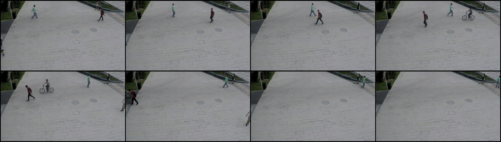
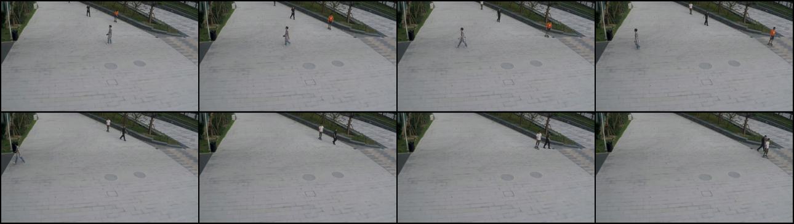
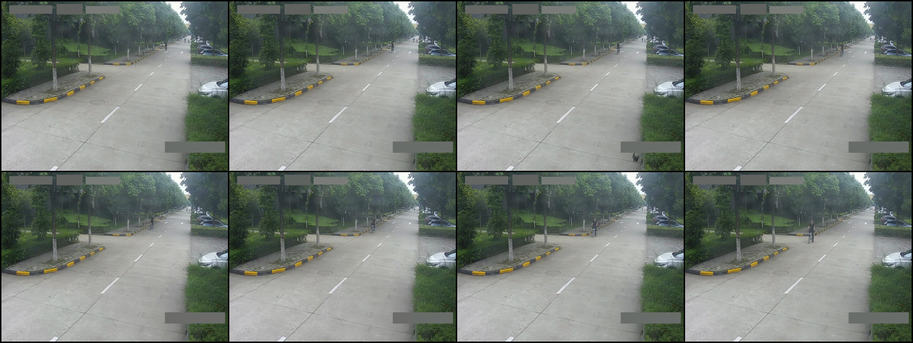
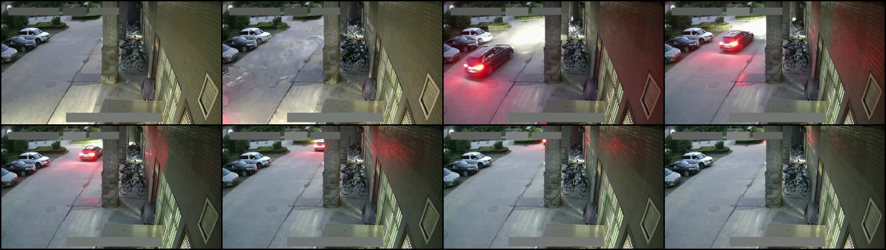

# Qwen3-VL 视频异常识别：物理异常、规则异常与 Token 压缩对照

> 数据快照：2026-09-02 
> 结果状态：**candidate-only / 非正式指标 / 不是 VerifiedFinding** 
> 总体结论：物理异常已有可复现的积极信号；规则异常仍明显不可用；本轮没有任何 Token 压缩方案通过预注册门禁。

## 结果总表

| 异常类型 | Token 条件 | 规模与评估口径 | 实际 Token | 主要结果 | 异常内容/证据 | 门禁与结论 |
|---|---|---|---:|---|---|---|
| 物理异常 | 不压缩 `FULL` | 32 个混合窗口；候选全帧复核后 31 个可判定 | 平均 `9,510`，保留 `100%` | 判断一致 `27/31 = 87.1%`；异常召回 `88.9%`；正常特异度 `84.6%` | 事件族内容匹配 `13/16 = 81.3%` | 作为参考基线；仍有 2 个假阳性和 2 个假阴性 |
| 规则异常 | 不压缩 `FULL` | 32 个“候选规则异常”正样本；没有正常对照，旧标签仍需人工复核 | 保留 `100%` | 只检出 `12/32`，候选召回 `37.5%`；不能报告 Accuracy 或 Specificity | 证据落地覆盖 `37.5%`；规则 ID 一致 `100%`；严格结构有效率仅 `34.4%` | **未通过**：召回、证据覆盖和输出合同均低于门槛 |
| 物理异常 | Token 压缩 | 同一批 32 个窗口；以固定预算 `JOINT_25` 为主要对照，动态 `ADAPT_12P5` 为补充 | `JOINT_25` 保留 `25%`；`ADAPT` 实际保留 `26.6%` | `JOINT_25` 判断一致仍为 `87.1%`；`ADAPT` 达 `90.3%`、异常召回 `94.4%` | `JOINT_25` 内容匹配降至 `75.0%`；`ADAPT` 为 `87.5%` | **均未通过**：前者丢失具体异常语义；后者未达到预设 12.5% Token 预算 |

物理异常压缩的详细策略仍保存在结构化审计摘要中，但不再展开成额外表格。当前只能说：约压缩 73%–75% 时仍保留较强的物理异常判断信号，尚不能宣称通过质量保持门禁。

## 规则型异常失败案例 Sheet

每张图按时间顺序展示同一段 8 秒窗口中的 8 帧（1 FPS 可视化；实际推理输入为 4 FPS、32 帧）。这些样本来自待复核的候选规则异常集合，因此以下分析区分“明确的模型失败”和“候选标签本身可能有问题”，不把弱标签当成正式真值。

### 1. 已识别骑车动作与区域关系，却仍输出 NORMAL

| 项目 | 内容 |
|---|---|
| 规则 | 步行区域内禁止骑自行车；无需画面中再次出现禁令标志 |
| 模型事实提取 | `person riding bicycle across plaza`；`bicycle moving through pedestrian zone` |
| 模型最终判断 | `NORMAL` |
| 模型反证 | `no visible restriction or prohibition sign` |
| 失败原因 | **规则应用失败。** 模型已经看见“人物—骑车—步行区域”，却额外要求现场标志，忽略了 Prompt 已提供的摄像头区域规则 |

### 2. 已说出 skateboard 及其区域关系，但结论和证据互相矛盾

| 项目 | 内容 |
|---|---|
| 规则 | 步行广场内禁止骑滑板或轮滑 |
| 模型事实提取 | `one person on skateboard`；`person on skateboard moving within pedestrian area` |
| 模型最终判断 | `NORMAL` |
| 输出合同 | 失败：给出 17 个时间点，超过最多 6 个时间点的约束 |
| 失败原因 | **决策—证据一致性失败。** 模型文本已经满足规则关系，但最终标签仍为 NORMAL；同时结构化输出失控 |
| 数据边界 | 人物较小，是否持续骑乘仍需人工查看原视频确认 |

### 3. 能看见自行车和方向箭头，但方向关系判断与候选标签冲突

| 项目 | 内容 |
|---|---|
| 规则 | 非机动车沿可见单行方向逆行才算异常 |
| 模型事实提取 | 看见骑车者、道路和白色方向箭头 |
| 模型最终判断 | `NORMAL`，认为骑车方向与箭头一致 |
| 失败原因 | **方向与透视绑定困难。** 主体很小、运动方向需跨帧判断，箭头朝向还受透视影响 |
| 数据边界 | 候选标签认为它是逆行，但仅凭此 Sheet 不能可靠裁决；必须人工逐帧复核原视频 |

### 4. 候选标签声称“停车阻塞”，但 Sheet 更像车辆驶过

| 项目 | 内容 |
|---|---|
| 规则 | 车辆持续停靠并占据指定通道才算异常 |
| 模型事实提取 | `a car driving away`；没有跨帧持续停车或明显阻塞 |
| 模型最终判断 | `NORMAL` |
| 失败原因 | **更可能是弱标签质量问题，而不是模型漏检。** 8 帧中车辆持续移动，缺少“停止 + 阻塞指定通道”的可见关系 |
| 数据边界 | 该样本不应直接计入正式假阴性；需人工复核事件区间和通道标注 |

四个案例共同说明，规则异常的瓶颈不是只看见对象，而是要稳定完成：`主体 → 动作 → 区域/方向/通道关系 → 规则应用 → 标签与证据一致性`。同时，当前 32 个规则正样本中的弱标签噪声会压低候选召回，正式指标前必须先做人工复核。

## 如何解读

1. **物理异常比规则异常更容易识别。** 火灾、爆炸、暴力、摔倒等具有直接视觉后果的事件，在不压缩时已经出现可用信号；“某区域禁止骑车/逆行/停靠”需要同时理解人物、动作、对象、区域和规则，当前单模型链路尚未闭合。
2. **压缩没有获得正式通过。** `JOINT_25` 是当前最稳妥的固定预算候选：用四分之一 Token 保住了二分类结果，但会损失具体异常内容。`ADAPT_12P5` 数字最好，却没有真正达到 12.5% 预算，不能包装成成功。
3. **不能横向比较 87.1% 与 37.5% 为同一种准确率。** 物理异常数字来自混合正负样本的候选复核；规则异常只有待复核正样本，只能报告候选召回与证据覆盖。
4. **当前推荐仍是 NO-GO。** 在新的、不可见的、人工审计测试集上复现之前，不采用任何压缩方案，也不宣称模型已经可靠识别规则异常。

## 可信度边界

- 两组审计均为 `candidate-only`，`formal_metric=false`。
- 没有 `VerificationReceipt`，没有 `VerifiedFinding`，没有写入可信 ledger。
- 推理阶段未看到评估标签；复核只用于事后统计。
- 物理异常的“候选全帧复核”仍不是正式人工真值；规则异常使用的旧 LLM 标签明确标记为 `needs_review`。
- 压缩运行与 FULL 基线的生成耗时不具备公平的端到端计时条件，因此本页不宣称推理加速倍数。

## 可复核的公开摘要

| 文件 | 内容 |
|---|---|
| [`data/results-summary.csv`](data/results-summary.csv) | 表格化的各策略汇总，可直接导入表格软件 |
| [`data/results-summary.json`](data/results-summary.json) | 结构化汇总、审计哈希与信任边界 |
| [`data/rule-failure-cases.json`](data/rule-failure-cases.json) | 四个规则失败案例的候选输出与审计解释 |

权威候选审计摘要哈希：

- 物理异常与压缩审计：`7bccd08e6320dce048591985c908df68f8161d26eef57907bd7d9c0f10c3ab82`
- 规则异常审计：`cf0c926a787edaba2f54f890968bf4b8b90465a406037763b8b808084c9ffab9`
