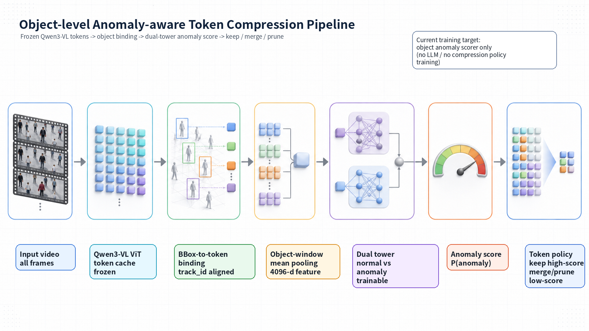
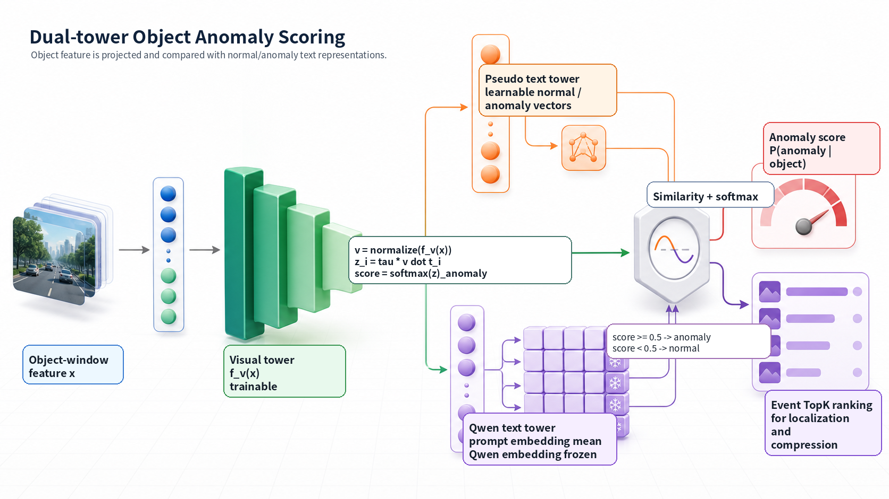
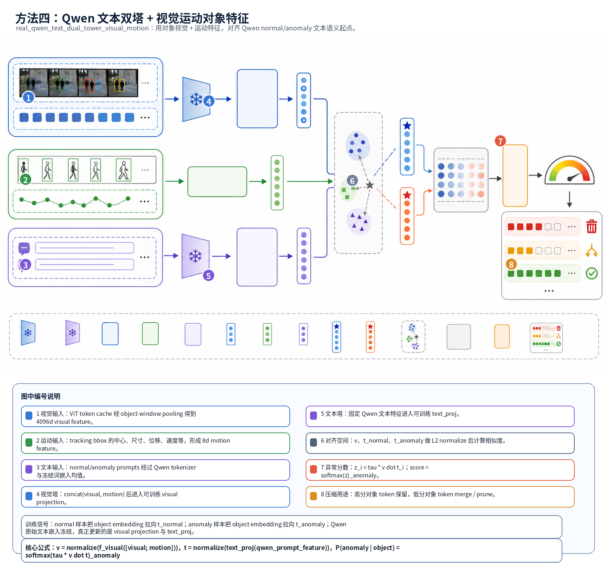

# 组会汇报：对象级异常双塔方法

## 1. 核心目标

我们希望把视频异常检测从整帧判断转成对象级判断：

```text
video -> object tokens -> object embedding -> dual-tower anomaly score
```

当前阶段只训练 **对象级异常打分器**，不训练 Qwen3-VL、不训练 tracking，也不训练 token compression policy。后续 token compression 可以直接使用 object anomaly score：

```text
高分对象 token -> 保留
低分对象 token -> merge / prune
```

---

## 2. 方法 Pipeline



流程概括：

1. 对所有视频帧提取并缓存 Qwen3-VL ViT tokens。
2. 用 tracking bbox 将视觉 tokens 绑定到 object。
3. 对一个 object 在短时间窗口内的 tokens 做 mean pooling，得到 object embedding。
4. 用双塔模型计算 object 与 normal/anomaly 表示的相似度。
5. 输出 object anomaly score。

---

## 3. Object Feature 构造

全帧 token cache：

```text
总帧数：210,880
cache 大小：916GB
ViT 像素预算：768 * 768
```

实际 ViT 输入尺寸保持长宽比：

```text
16:9 -> 1024 x 576
4:3  -> 864 x 640
```

每个 object-window 样本：

```text
track_id + 32 raw frames window + stride 4 sampled 8 frames
```

特征：

```text
visual feature: [11174, 4096]
motion feature: [11174, 8]
```

---

## 4. 双塔模型



双塔由两侧组成：

- visual tower：输入 object feature，输出 object embedding。
- text/prompt tower：输出 normal / anomaly 两个文本侧表示。

异常分数由 object embedding 和 normal/anomaly 表示的相似度得到。

---

## 5. Anomaly Vector 与 Text Prompt 的关系

这里要区分：

```text
text prompt:
    人写的 normal/anomaly 自然语言描述

anomaly vector:
    双塔对齐空间里的异常类别原型
```

当前 anomaly vector **不是插入 Qwen LLM prompt 的 soft token**，也没有经过完整 Qwen LLM hidden state。它位于双塔的 text-side representation 中，用来和 object embedding 做相似度比较。

### Pseudo Dual Tower

直接学习两个向量：

```text
prompt_embeddings[0] = normal vector
prompt_embeddings[1] = anomaly vector
```

异常样本会把 object embedding 拉向 anomaly vector；正常样本会把 object embedding 拉向 normal vector。

### Qwen Text Dual Tower

先用自然语言 prompt 得到 Qwen 词嵌入均值：

```text
normal prompts  -> Qwen token embeddings mean
anomaly prompts -> Qwen token embeddings mean
```

Qwen 词嵌入冻结，只训练 text projection。也就是说，Qwen text 版本不是直接训练 prompt embedding，而是训练投影后的 normal/anomaly 表示。

更具体地说，文本 prompt 先被转换成固定嵌入向量：

```text
text prompt
  -> Qwen tokenizer
  -> Qwen embedding table
  -> prompt embedding mean
```

这个 prompt embedding mean 本身不更新。训练过程中更新的是后面的 projection：

```text
fixed prompt embedding
  -> trainable text projection
  -> projected normal/anomaly representation
```

所以“投影后的向量”不是一个被直接保存并更新的参数，而是 projection 每次根据固定文本嵌入实时算出来的输出。projection 参数变了，同一个 prompt embedding 再投影出来的 normal/anomaly 表示也会随之改变。

本次实验是二分类，所以当前只使用：

```text
1 个 normal representation
1 个 anomaly representation
```

不是每个异常类别一个 vector。

---

## 6. 异常分数如何得到

视觉侧：

```text
v = normalize(f_visual(x))
```

文本侧：

```text
t_normal  = normalize(f_text(normal))
t_anomaly = normalize(f_text(anomaly))
```

相似度：

```text
z_normal  = tau * dot(v, t_normal)
z_anomaly = tau * dot(v, t_anomaly)
```

异常分数：

```text
P(normal), P(anomaly) = softmax([z_normal, z_anomaly])
anomaly_score = P(anomaly)
```

固定阈值：

```text
score >= 0.5 -> anomaly
score < 0.5  -> normal
```

事件定位时按 `anomaly_score` 排序，计算 Event TopK Recall。

---

## 7. 数据划分

本次使用所有可训练异常事件，包含 T01-T05 和 R06。R06 作为 anomaly 类参与二分类训练。

| 项目 | 数值 |
|---|---:|
| 异常事件 | 256 |
| object-window 样本 | 11,174 |
| train 样本 | 8,172 |
| val 样本 | 3,002 |
| anomaly 正样本 | 6,053 |
| normal 负样本 | 5,121 |

划分方式：

```text
train / val only
val ratio ≈ 30%
scene-disjoint split
train/val scene overlap = 0
```

scene-disjoint 划分可以减少同场景随机划分造成的“开卷考试”。

---

## 8. 四种双塔方法

| 方法 | 文本侧 | 输入 |
|---|---|---|
| pseudo_dual_tower_visual_only | 可学习 normal/anomaly vectors | visual |
| pseudo_dual_tower_visual_motion | 可学习 normal/anomaly vectors | visual + motion |
| real_qwen_text_dual_tower_visual_only | Qwen prompt embedding mean | visual |
| real_qwen_text_dual_tower_visual_motion | Qwen prompt embedding mean | visual + motion |

简单理解：

- `pseudo_visual_only`：对象视觉特征 vs 可学习 normal/anomaly 原型。
- `pseudo_visual_motion`：在上面基础上加入 bbox 运动特征。
- `qwen_text_visual_only`：对象视觉特征 vs Qwen 文本语义初始化的 normal/anomaly 表示。
- `qwen_text_visual_motion`：Qwen 文本语义初始化 + 视觉运动拼接特征。

---

## 9. 重点方法：real_qwen_text_dual_tower_visual_motion

第四种方法是：

```text
real_qwen_text_dual_tower_visual_motion
```

它可以自然语言理解为：

```text
对象视觉特征 + 对象运动特征
    vs
Qwen 文本 prompt 初始化的 normal/anomaly 表示
```



这张图从模型数据流角度说明方法四。蓝色分支表示从 Qwen3-VL ViT token cache 中得到的 object-window 视觉特征；绿色分支表示 tracking bbox 产生的运动特征；紫色分支表示 normal/anomaly 文本 prompt 经过 Qwen tokenizer 和词嵌入均值后得到的固定文本语义起点。三路信息不会直接送入 Qwen LLM 生成答案，而是在双塔对齐空间里比较相似度。

图中需要特别注意两点。第一，Qwen 的文本嵌入是冻结的，训练时更新的是 `text_proj` 和视觉侧 projection。第二，最终的异常分数来自 object embedding 与 `t_normal`、`t_anomaly` 的余弦相似度 softmax；高分对象后续更适合保留 token，低分对象更适合 merge 或 prune。

### 输入端

每个 object-window 的输入由两部分组成：

```text
visual feature: 4096 维
motion feature: 8 维
```

拼接后得到：

```text
x = concat(visual, motion)
dim(x) = 4104
```

visual feature 描述对象外观与局部上下文，motion feature 描述 bbox 中心、尺寸、位移、速度和检测置信度等轨迹信息。

### 文本端

文本端不是随机学两个向量，而是从 Qwen 的 normal/anomaly prompt 语义出发。

normal/anomaly prompt 先变成固定 Qwen 文本嵌入：

```text
normal prompts  -> fixed qwen_normal_text_feature
anomaly prompts -> fixed qwen_anomaly_text_feature
```

然后通过可训练 projection：

```text
t_normal  = normalize(text_proj(qwen_normal_text_feature))
t_anomaly = normalize(text_proj(qwen_anomaly_text_feature))
```

Qwen 文本嵌入本身冻结；`text_proj` 会被训练。因此训练后改变的是投影方式，而不是原始 prompt embedding。

### 训练时文本塔如何更新

如果样本是正常对象，loss 会推动：

```text
object embedding 更接近 t_normal
object embedding 远离 t_anomaly
```

如果样本是异常对象，loss 会推动：

```text
object embedding 更接近 t_anomaly
object embedding 远离 t_normal
```

梯度会更新 `text_proj`。于是同一个固定 anomaly prompt embedding 再经过 projection 时，输出的 `t_anomaly` 会逐渐转向训练集中异常对象所在的方向。

所以这个方法的文本塔可以理解为：

```text
Qwen 提供 normal/anomaly 语义起点
projection 把这个语义起点适配到对象级异常检测空间
```

### 为什么关注这个方法

它的对象级 Balanced Acc 不是最高，但事件级排序最好：

```text
Event Top3 Recall = 1.0000
```

这说明它很适合后续 token compression 场景：我们不一定只依赖固定阈值，而是更关心一个事件里异常对象能否排到前几名，从而优先保留这些对象的 tokens。

---

## 10. 训练设置

```text
normal = 0
T01/T02/T03/T04/T05/R06 = 1
```

| 配置 | 数值 |
|---|---:|
| epochs | 80 |
| batch size | 64 |
| learning rate | 1e-3 |
| embedding dim | 256 |
| tau | 10.0 |
| threshold | 0.5 |

损失：

```text
L = CE(normal/anomaly logits, label) + 0.1 * L_sep
```

其中 `L_sep` 防止 normal/anomaly 两个文本侧表示塌缩到一起。

---

## 11. 实验结果

| 方法 | Val Balanced Acc | Anomaly Recall | Normal FPR | AUROC | Event Top3 |
|---|---:|---:|---:|---:|---:|
| pseudo_dual_tower_visual_only | 0.7655 | 0.7582 | 0.2273 | 0.8228 | 0.9762 |
| pseudo_dual_tower_visual_motion | 0.7351 | 0.7210 | 0.2507 | 0.7794 | 0.9524 |
| real_qwen_text_dual_tower_visual_only | 0.7456 | 0.6716 | 0.1804 | 0.7953 | 0.9762 |
| real_qwen_text_dual_tower_visual_motion | 0.7565 | 0.7088 | 0.1957 | 0.8105 | 1.0000 |

主要观察：

- 对象级分类指标最好的是 `pseudo_dual_tower_visual_only`。
- 事件级 Top3 最好的是 `real_qwen_text_dual_tower_visual_motion`。
- Qwen text 版本误报率较低，但异常召回偏低。
- 加 motion 后没有稳定提升，说明当前 motion feature 仍有噪声。

---

## 12. 结论

本次实验说明：

1. 对象级双塔异常打分是可行的。
2. `pseudo_dual_tower_visual_only` 可作为当前对象异常分数 baseline。
3. Event Top3 Recall 较高，说明异常对象通常能排到前几名，适合后续 TopK token compression。
4. scene-disjoint 验证下 train/val 差距明显，跨场景泛化仍是主要问题。
5. T01 类异常较难，需要更多时序和姿态相关信息。

---

## 13. 下一步

建议：

- 使用 `pseudo_dual_tower_visual_only` 作为 token compression 的初始 object score。
- 针对 T01 增强样本和时序特征。
- 改进 motion feature 或加入 lightweight temporal encoder。
- 尝试完整 Qwen LLM hidden-state 文本塔。
- 将 object anomaly score 接入 token merge/prune 实验。

---

## 14. 文件位置

```text
组会文档:
GROUP_MEETING_DUAL_TOWER_CN.md

完整实验报告:
DUAL_TOWER_REPORT_CN.md

结果目录:
/home/expand_disk/data_repository/mfl/token_compression/20260613_data/results/exp_20260616_allframes_maxpix768_all_events_trainval30_dual_tower_v1
```
