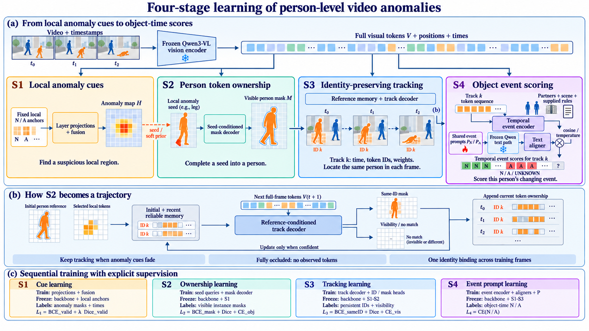

# 图

# 四阶段训练

以下为拟采用的训练流程。全程冻结 Qwen3-VL 骨干，依次训练四个阶段；训练后续阶段时，冻结前面已经训练的模块。各阶段保留完整视觉特征，异常图只作为候选线索。该方案需要实例掩码和持续 ID 等细粒度监督。

**第一阶段：训练局部异常线索**

输入多层视觉 Token，与固定的正常／异常文本锚点计算相似度，融合得到异常图 H。使用异常区域掩码和事件时间标注，通过有效标注范围内的 BCE 与 Dice 损失训练视觉投影和多层融合权重，学习“哪些位置包含异常证据”。骨干和局部文本锚点保持冻结。

**第二阶段：训练人物 Token 归属**

以局部异常热点为种子，让实例掩码解码器读取当前帧完整特征，预测该热点所属人物的可见区域 M。使用正常和异常人物的实例掩码监督，训练种子 Query、掩码解码器及 person／no-object 预测头，损失为掩码 BCE、Dice 和对象分类损失。

训练初期可从标注人物区域采样局部种子，学习从局部补全人物；随后使用冻结 S1 的预测种子训练。输出是这个人在当前帧拥有哪些 Token，跨帧身份由第三阶段建立。

**第三阶段：训练持续身份跟踪，是最难的一步**

难点在于：第二阶段只能给出单帧人物区域，而同一个人在相邻帧可能移动、转身、跌倒或被遮挡。需要训练模型持续定位同一个人，避免在人群交叉时换人。

1. **初始化人物参考**：利用 S2 的人物掩码提取整体特征和局部 Token，建立初始记忆。在训练片段开始时，将该轨迹与一个标注人物 ID 绑定。
2. **预测下一帧区域**：轨迹解码器读取上一时刻的人物参考和下一帧完整特征，输出同一人的可见掩码及可见性。使用该 ID 在下一帧的真值掩码计算 BCE 和 Dice，并训练可见性预测。
3. **固定身份监督**：整段训练中始终监督到同一个人，不能每帧重新匹配成另一个容易分割的人物。即使人物从站立变成跌倒，身份目标也保持不变。
4. **学习连续预测**：从短片段逐步扩展到多帧，使用模型自己预测的掩码和记忆继续跟踪，减少对逐帧真值输入的依赖。关联可信时更新近期记忆，同时保留初始参考，降低身份漂移。

部分遮挡时只监督可见区域；完全遮挡时记录空观测并训练可见性状态，不补造人物轮廓。异常线索消失后仍继续跟踪，以保留事件前后的状态。

本阶段冻结骨干和 S1、S2，训练独立的轨迹解码器、身份投影、掩码及可见性头。最终需要检查掩码质量、身份切换和遮挡恢复，确认得到的是同一人物的逐帧 Token 集合。

**第四阶段：训练对象级异常评分**

输入同一人物在多个时刻的原始视觉 Token、位置与可见性，结合交互和场景证据，通过事件编码器形成时序表示，再与共享的正常／异常事件 Prompt 对齐。使用对象时间级正常／异常标签，以交叉熵训练事件编码器、图文对齐层和事件 Prompt；UNKNOWN 与未标注目标不参与二分类损失。

先固定事件 Prompt 训练编码器和对齐层，再开放 Prompt 更新。S4 的事件 Prompt 与 S1 的固定局部锚点独立；文本骨干权重冻结，但保留损失到软 Prompt 的梯度路径。
