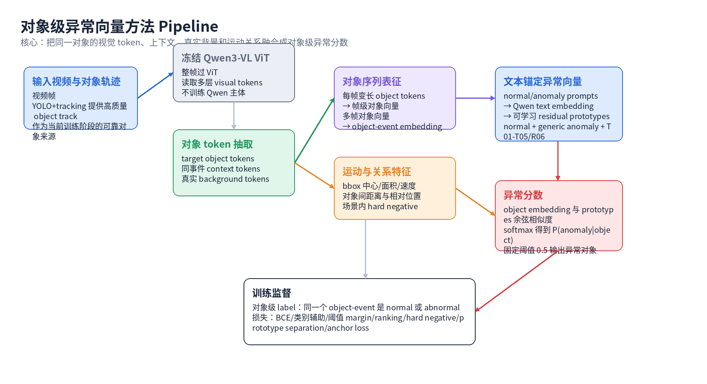

# Object-level Anomaly Vector 组会汇报

本次只汇报 anomaly vector 这条线：目标是训练一个对象级异常评分器，让模型判断“哪个对象异常”，而不是只判断“整段视频异常”。

## 方法概览



当前效果最稳的主方法可以概括为：

```text
文本锚定残差异常向量
+ target object tokens
+ context object tokens
+ real background tokens
+ bbox motion / relation features
+ fixed-threshold FPR guard
```

输入不是整段视频的全局表示，而是同一个 object track 的对象级 token 序列。训练阶段先使用高质量 YOLO + tracking 得到可靠 object track，再从冻结的 Qwen3-VL ViT token cache 中取出对象相关 token。

数据流如下：

```text
视频帧
-> 冻结 Qwen3-VL ViT
-> full-frame visual tokens
-> target object tokens
-> same-event context object tokens
-> real background tokens
-> motion / relation features
-> object-event embedding
-> normal / anomaly text-anchored vectors
-> object anomaly score
```

这套方法的关键点不是“把所有 token 简单平均”，而是把目标对象、同场景其他对象、真实背景和运动关系分开建模：

```text
target object tokens:
  当前要判断是否异常的对象，是异常分数的主证据。

context object tokens:
  同一个事件片段中的其他对象，用来判断交互和场景关系。

real background tokens:
  从 bbox 外真实背景区域采样，帮助模型区分“对象异常”和“场景背景相似”。

motion / relation features:
  包括 bbox 位置、面积、速度、对象间距离等，补充纯视觉 token 不稳定的运动线索。
```

这里的 bbox / motion / relation features 都不是额外人工标注出来的，而是由 tracking 结果自动计算得到：

```text
逐帧 tracking bbox:
  每个 object 在每一帧都有 bbox_xyxy = [x1, y1, x2, y2]
  同时保留 track_id、类别名、检测置信度和视频原始宽高
```

基础运动特征来自同一 object track 的逐帧 bbox：

| 特征 | 如何计算 |
|---|---|
| 中心位置 | `cx=(x1+x2)/2/video_width`, `cy=(y1+y2)/2/video_height` |
| 宽高 | `w=(x2-x1)/video_width`, `h=(y2-y1)/video_height` |
| 面积 | `area=w*h` |
| 速度 | 相邻帧 bbox 中心点位移：`sqrt(delta_x^2 + delta_y^2)` |
| 横向/纵向运动 | 相邻帧中心点的 `abs(delta_x)` 和 `abs(delta_y)` |
| 置信度 | tracking / detection 结果里的 confidence 均值 |

也就是说，如果一个人持续奔跑，他的 bbox 中心点在连续帧中会有更大的位移；如果对象接近镜头或远离镜头，bbox 面积会发生变化。

对象间关系特征来自同一帧中的其他 tracks：

| 特征 | 如何计算 |
|---|---|
| 最近对象距离 | 当前对象中心点到其他对象中心点的最小距离 |
| 平均对象距离 | 当前对象到其他对象中心点距离的均值 |
| 近邻数量 | 半径 `0.1 / 0.2 / 0.3` 内有多少其他对象 |
| bbox overlap | 当前对象 bbox 和其他对象 bbox 的 IoU / overlap count |
| 同类近邻数量 | 距离较近且类别相同的对象数量 |
| 最近对象类别 | 最近邻对象属于人、车辆、非机动车还是其他类别 |
| 边界距离 | 当前对象中心点到画面边界的最小距离 |

这些统计量会被归一化后作为 side features 输入模型。当前主方法中 side features 维度是 `125`，其中包含基础 bbox 运动信息、对象间关系统计，以及部分 token 数量/轨迹长度统计。

最终模型不是输出视频级异常，而是对每个 object-event 输出一个对象级异常分数：

```text
同一事件里有多个 object
-> 每个 object 单独打分
-> 分数最高的对象就是模型认为最可能异常的对象
```

具体实现时，每个 object-event 会经过以下几步：

1. **对象 token 聚合。**

   同一个 object 在每一帧里覆盖的 token 数量不同，所以先把每帧变长的 object tokens 聚合成一个帧级对象向量。这样可以把“一帧中这个对象的视觉证据”压成固定维度表示。

2. **跨帧聚合。**

   一个 object-event 包含多帧对象向量。模型再把这些帧级向量聚合成一个 object-event embedding，用来表示“这个对象在这一段时间里的整体状态”。

3. **上下文与背景融合。**

   target object embedding 会和同事件其他对象、真实背景、运动/关系特征融合。这样模型不只看对象外观，也能利用“对象和场景/其他对象之间的关系”。

4. **与 anomaly vectors 比较。**

   最终 object-event embedding 与 normal/anomaly vectors 计算相似度，得到对象级异常分数。

## Anomaly Vector 如何得到

不是直接训练一个普通二分类 head，而是更接近 AnomalyCLIP 的思路：先用文本语义初始化 normal / anomaly 方向，再通过对象级监督微调这些方向。

```text
normal / anomaly prompts
-> Qwen tokenizer + frozen text embedding
-> text prototype base
-> trainable projection / residual
-> normal / anomaly vectors
```

当前 prototype 设置：

| 类型 | 数量 | 作用 |
|---|---:|---|
| normal prototypes | 4 | 表示正常行人、车辆、普通物体运动 |
| generic anomaly prototypes | 2 | 表示通用异常行为 |
| 具体异常类型 prototypes | 每类 3 个 | 覆盖行人动作异常、非机动车异常、机动车异常、打斗/群体异常、物体交互异常 |
| 稀有异常 prototype | 1 | 作为开放集异常辅助方向 |
| 总数 | 22 | 共同参与对象异常打分 |

推理时主要使用 binary anomaly score：

```text
score(object) = P(anomaly | object)
```

异常小类原型主要作为辅助训练信号，让 anomaly vector 不至于全部塌缩到一个粗糙方向。

更具体地说，训练时对象向量和这些 normal / anomaly vectors 做相似度比较。如果对象是真实异常对象，训练会把它拉近 anomaly vectors；如果对象是正常对象，训练会把它拉近 normal vectors。这样得到的 anomaly vector 不是凭空学出的分类权重，而是“文本语义初始化 + 对象级异常监督”共同形成的可学习方向。

## 训练设置

| 项目 | 设置 |
|---|---|
| 训练单位 | 一个 object 在一个事件片段内的 object-event token sequence |
| 视觉特征 | 冻结 Qwen3-VL ViT token cache |
| 训练样本 | 4371 个 object-event |
| 训练正样本 | 518 |
| 训练负样本 | 3853 |
| 验证样本 | 1251 个 object-event |
| 验证异常对象 | 147 |
| 验证正常对象 | 1104 |
| 阈值口径 | 固定 threshold = 0.5 |
| 训练目标 | 对象级 normal / abnormal 判断 |

损失函数由几部分组成：

| Loss | 目的 |
|---|---|
| binary anomaly loss | 判断对象是否异常 |
| category auxiliary loss | 用具体异常类型辅助约束异常方向 |
| threshold margin loss | 让异常分数推到 0.5 以上，正常分数压到 0.5 以下 |
| ranking loss | 异常对象分数应高于正常对象 |
| hard negative loss | 压低容易误报的正常对象 |
| same-event negative constraint | 同一个异常事件里的正常对象不能被误判成异常 |
| prototype separation loss | 防止 normal / anomaly vectors 混在一起 |
| text anchor loss | 防止可学习向量偏离文本语义太远 |

## 核心指标

当前主方法在固定阈值 `0.5` 下表现比较均衡：Precision、Recall、F1 和 FPR 都比较稳定，适合作为当前组会主方法。

| 指标 | 数值 | 含义 |
|---|---:|---|
| Accuracy | 0.9448 | 所有正常/异常对象整体判断正确率 |
| Precision | 0.7566 | 被判为异常的对象里，有多少真的异常 |
| Recall | 0.7823 | 真实异常对象里，有多少被找出来 |
| F1 | 0.7692 | Precision 和 Recall 的综合指标 |
| FPR | 0.0335 | 正常对象被误判成异常的比例 |
| AUROC | 0.9509 | 不固定阈值时的排序能力 |
| AUPRC | 0.8132 | 异常样本较少时更关注的排序指标 |
| Event Top1 Recall | 0.9138 | 每个异常事件中，最高分对象命中异常对象的比例 |

这个结果说明两点：

```text
1. 对象级 anomaly vector 已经有较好的排序能力。
2. 固定阈值下不能只追求召回率，否则会把同场景正常对象也误判成异常。
```

分类型观察上，机动车异常、打斗/群体秩序异常相对更容易；行人动作异常和物体状态/交互异常更难。稀有开放集异常样本很少，不能据此说明开放集异常已经解决。

## 不同阈值下的表现

异常分数越过阈值就判为异常。阈值越低，模型越容易报警，Recall 通常更高，但正常误报也会增加；阈值越高，模型更保守，Precision 通常更高，但会漏掉更多异常对象。

| Threshold | Accuracy | Recall | Precision | FPR | F1 |
|---:|---:|---:|---:|---:|---:|
| 0.05 | 0.9153 | 0.8367 | 0.6000 | 0.0743 | 0.6989 |
| 0.10 | 0.9281 | 0.8299 | 0.6524 | 0.0589 | 0.7305 |
| 0.20 | 0.9353 | 0.8027 | 0.6941 | 0.0471 | 0.7445 |
| 0.30 | 0.9392 | 0.7891 | 0.7205 | 0.0408 | 0.7532 |
| 0.40 | 0.9432 | 0.7891 | 0.7436 | 0.0362 | 0.7657 |
| 0.50 | 0.9448 | 0.7823 | 0.7566 | 0.0335 | 0.7692 |
| 0.60 | 0.9472 | 0.7755 | 0.7755 | 0.0299 | 0.7755 |
| 0.70 | 0.9456 | 0.7551 | 0.7762 | 0.0290 | 0.7655 |
| 0.80 | 0.9456 | 0.7415 | 0.7842 | 0.0272 | 0.7622 |
| 0.90 | 0.9456 | 0.7075 | 0.8062 | 0.0226 | 0.7536 |
| 0.95 | 0.9424 | 0.6735 | 0.8049 | 0.0217 | 0.7333 |

从表中可以看到：

```text
1. 如果更关心不要漏异常，可以把阈值降到 0.1-0.2，Recall 会升高，但 FPR 也会上升。
2. 如果更关心报警可靠性，可以把阈值提高到 0.6-0.9，Precision 会更高，但 Recall 会下降。
3. 固定阈值 0.5 是当前折中点：Recall 仍有 0.7823，同时 FPR 控制在 0.0335。
```

## 召回优先训练探索

也尝试了更偏召回的训练策略，它和当前主方法不是同一个取舍：主方法强调低误报和固定阈值稳定性；召回优先探索版强调尽量不要漏掉异常对象。

两种做法的核心区别如下：

| 对比项 | 当前主方法：低误报稳定型 | 召回优先探索版 |
|---|---|---|
| 训练目标 | 固定阈值下 Precision / Recall / FPR 更均衡 | 尽量提高异常 Recall |
| 正负样本策略 | 正样本比例较克制，同时更强调 hard negative | 提高异常样本权重，让模型更容易把可疑对象判为异常 |
| 正常对象约束 | 更强的正常对象约束和 FPR guard | 正常约束相对放松，允许更多对象被判为可疑 |
| 同事件正常对象 | 强调压低同一异常事件里的正常对象分数 | 也使用同事件 hard negative，但更偏向保护异常召回 |
| 阈值附近训练 | 希望异常过 0.5、正常低于 0.5，同时控制误报 | 更强地推动异常对象越过阈值 |
| 结果倾向 | 误报低，整体更稳 | 召回高，但误报增加 |

可以理解为：

```text
当前主方法：
  更像“报警要更可靠”，所以 FPR 低、Precision 更好。

召回优先探索版：
  更像“异常对象尽量别漏”，所以 Recall 更高，但会多保留正常对象。
```

### 召回优先探索版的具体指标

固定阈值 `0.5` 下，召回优先探索版的结果如下：

| 指标 | 数值 | 含义 |
|---|---:|---|
| Accuracy | 0.9000 | 所有正常/异常对象整体判断正确率 |
| Precision | 0.5285 | 被判为异常的对象里，有多少真的异常 |
| Recall | 0.8883 | 真实异常对象里，有多少被找出来 |
| F1 | 0.6627 | Precision 和 Recall 的综合指标 |
| FPR | 0.0985 | 正常对象被误判成异常的比例 |
| AUROC | 0.9571 | 不固定阈值时的排序能力 |
| AUPRC | 0.7631 | 异常样本较少时更关注的排序指标 |
| Event Top1 Recall | 0.9420 | 每个异常事件中，最高分对象命中异常对象的比例 |
| TP / FP / TN / FN | 167 / 149 / 1363 / 21 | 混淆矩阵 |

它相比当前主方法的主要变化是：

```text
Recall 从 0.7823 提高到 0.8883，
但 Precision 从 0.7566 降到 0.5285，
FPR 从 0.0335 升到 0.0985。
```

也就是说，它确实更不容易漏异常，但会把更多正常对象也判成异常。

### 召回优先探索版在不同阈值下的表现

| Threshold | Accuracy | Recall | Precision | FPR | F1 |
|---:|---:|---:|---:|---:|---:|
| 0.15 | 0.8771 | 0.9362 | 0.4718 | 0.1303 | 0.6275 |
| 0.50 | 0.9000 | 0.8883 | 0.5285 | 0.0985 | 0.6627 |
| 0.75 | 0.9071 | 0.8617 | 0.5510 | 0.0873 | 0.6722 |
| 0.95 | 0.9282 | 0.7447 | 0.6542 | 0.0489 | 0.6965 |

这个表说明：即使把阈值提高到 `0.75`，召回优先探索版仍然有 `0.8617` 的 Recall，但 FPR 仍高于当前主方法。因此它更适合证明“召回上限还有空间”，暂时不适合作为最终主方法。

## 主要困难

1. **异常召回和误报率存在明显拉扯。**

   拉高 Recall 往往会把同场景正常对象也抬高，导致 FPR 上升。这个问题在同一个异常事件中尤其明显：异常对象旁边的正常对象也有相似场景背景。

2. **行人动作异常仍然难。**

   这类异常包含奔跑、摔倒、攀爬、徘徊等动作，很多证据来自连续多帧步态或姿态变化。单个 object-event 的平均视觉表征容易被正常帧稀释。

3. **稀有开放集异常样本太少。**

   当前这类异常召回看起来高，但验证样本只有 3 个，不具备统计说服力。它更适合作为开放集测试，不适合作为强监督类别。

4. **固定阈值校准仍然关键。**

   AUROC 高说明排序能力不错，但实际部署需要固定阈值可用。后续不能只追求 AUROC，需要继续看 `threshold=0.5` 下的 Precision / Recall / FPR。

5. **当前仍是离线 object-event 判断。**

   真实 VAD 场景中，系统只能看到历史帧，不能提前知道 object track 什么时候结束。下一步需要在线 causal anomaly score，让异常分数随历史帧累积，达到阈值后报警。

## 组会结论

当前 object-level anomaly vector 已经证明可行：Qwen3-VL object tokens 经过对象级聚合后，可以训练出有效的 anomaly vectors。后续最重要的不是继续堆复杂结构，而是围绕三个问题改进：

```text
1. 在不明显增加 FPR 的情况下提高行人动作异常和物体状态/交互异常的召回；
2. 加强同事件正常对象的 hard negative 约束；
3. 从离线 object-event 评分升级到在线历史帧累积评分。
```
